# Reaction-Diffusion

This is an interactive real-time reaction-diffusion system running in the browser using WebGL.

## [Live Demo](https://linusmossberg.github.io/reaction-diffusion/)

## Presets
I've created the following presets which can be selected at the top of the controls menu. The images are just the steady-states of the presets. Interacting and watching the growth process and dynamic behaviours in the live demo is much more interesting.
### Default
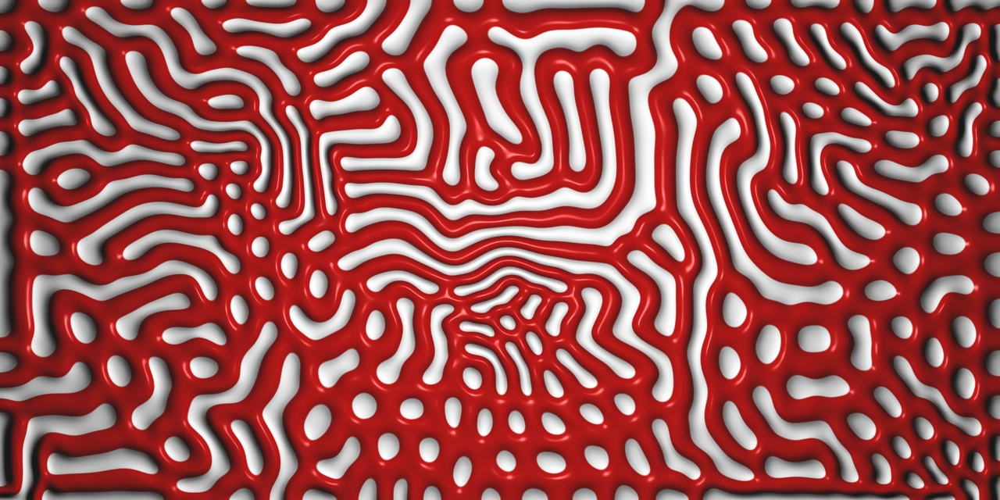
### Fingerprints
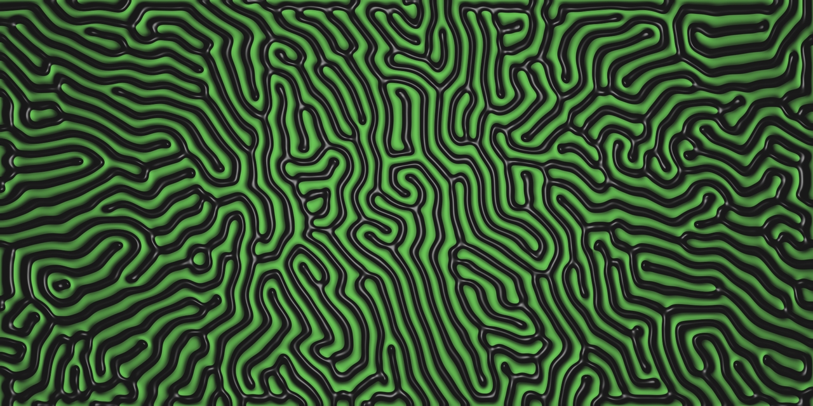
### Spots and Worms
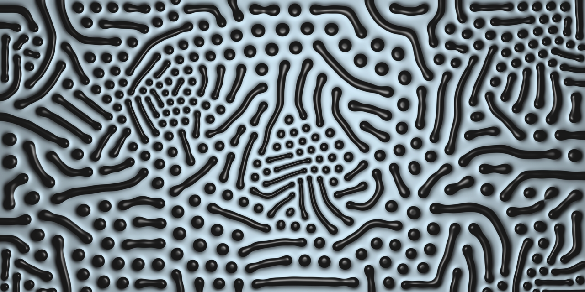
### Cell Division
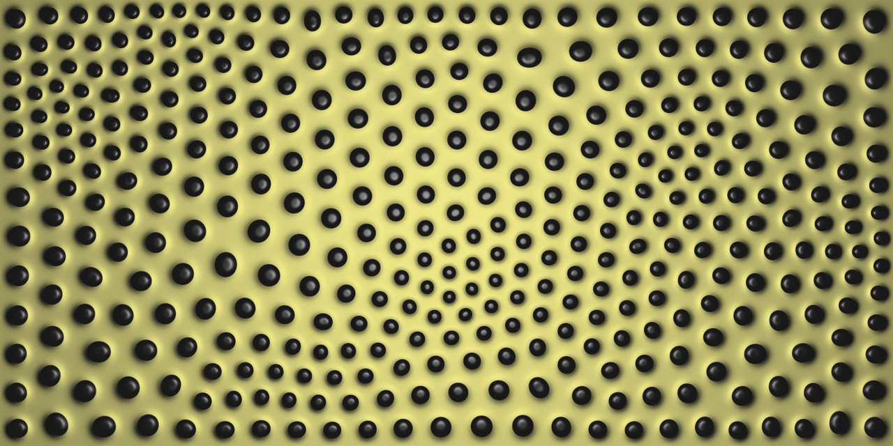
### Bouys
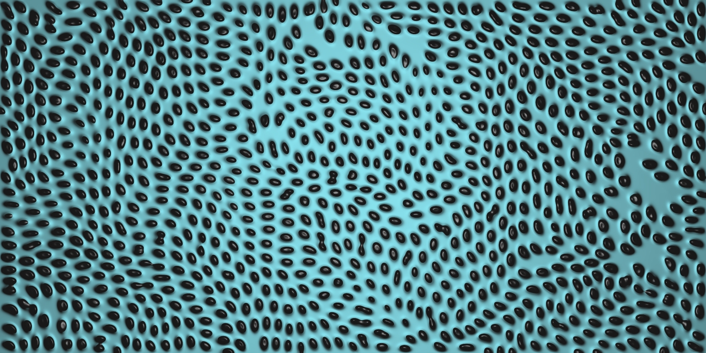
### Oil Spill
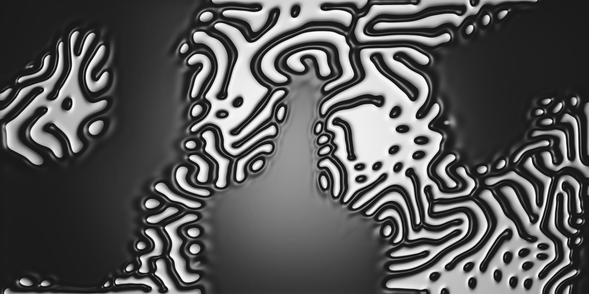
### Trypophobia
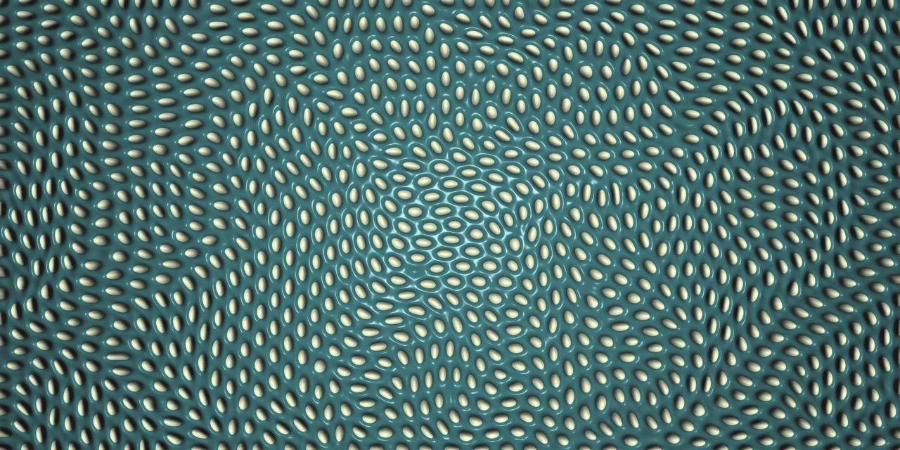
### Travellers
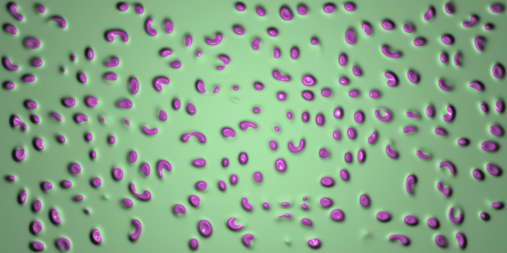
### Ocean
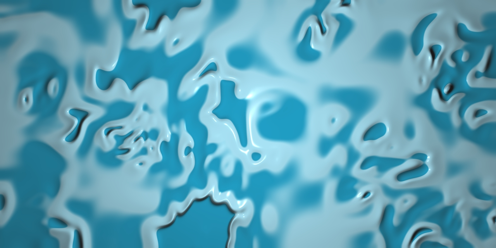
### Differential Line
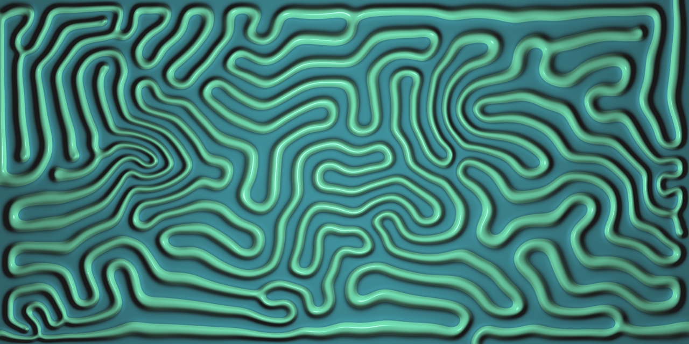
### Voronoi

### Worms
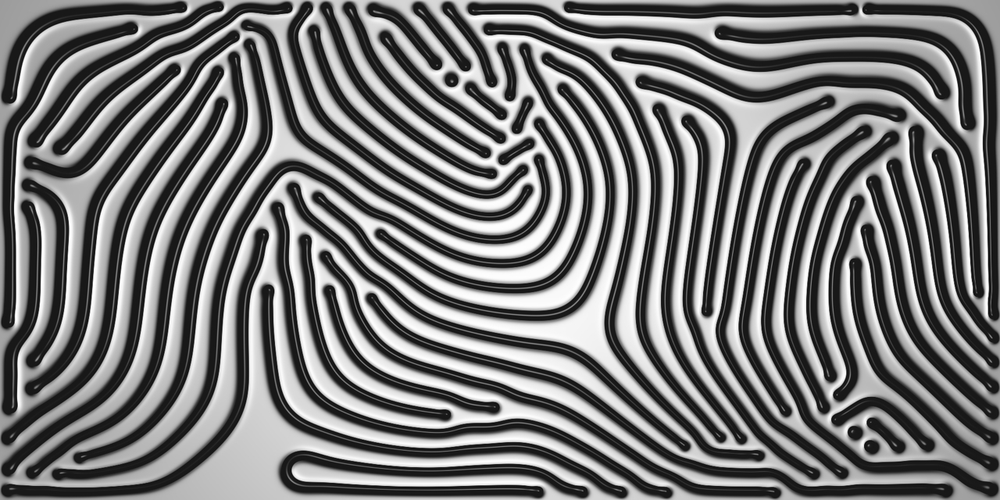
### Worm Mazes
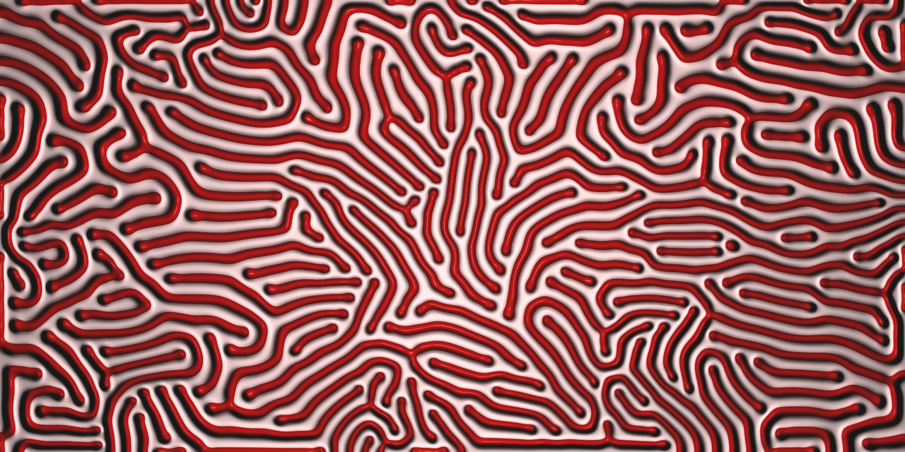
### Maze
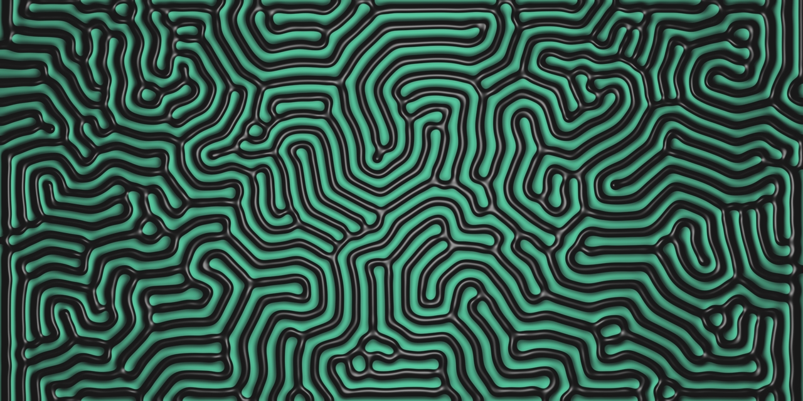
### Unstable Maze
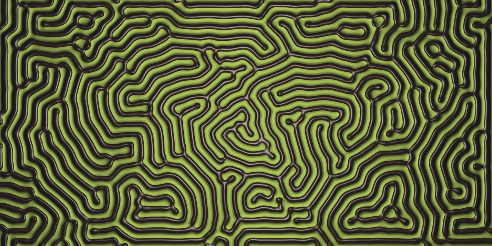
### Ripping
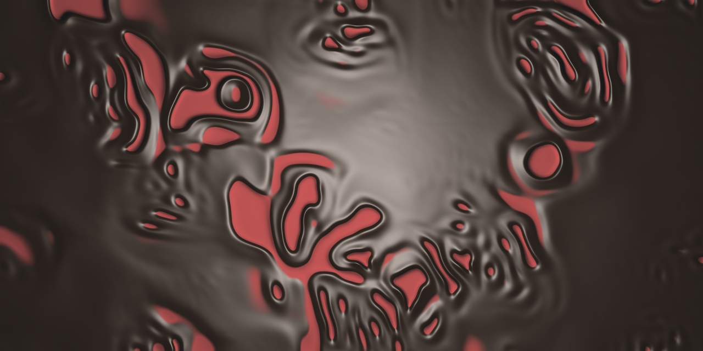
### Waves
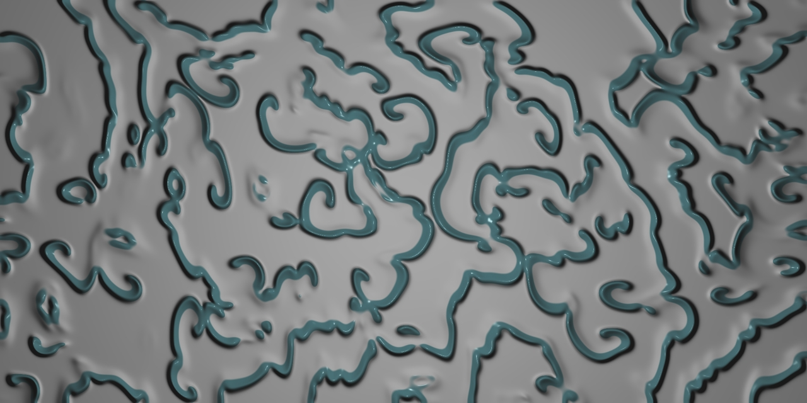
### Tensor Field Visualization
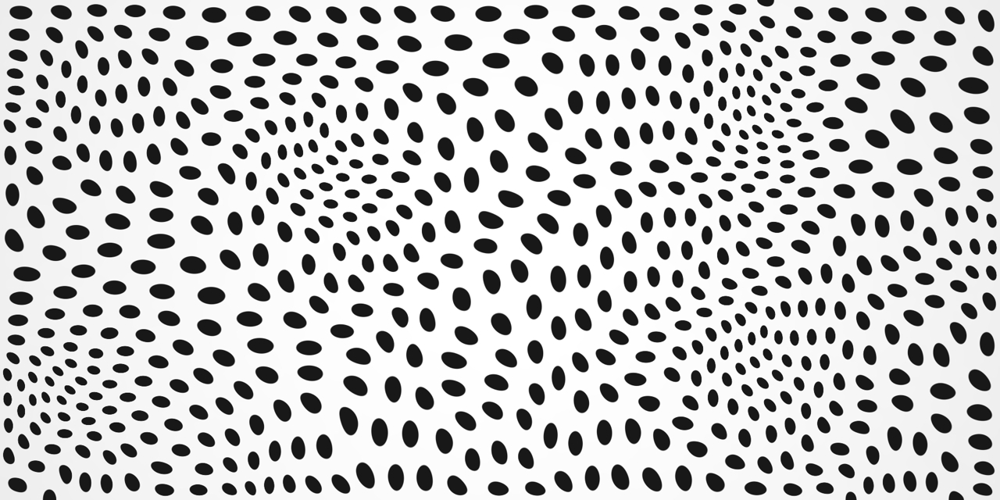